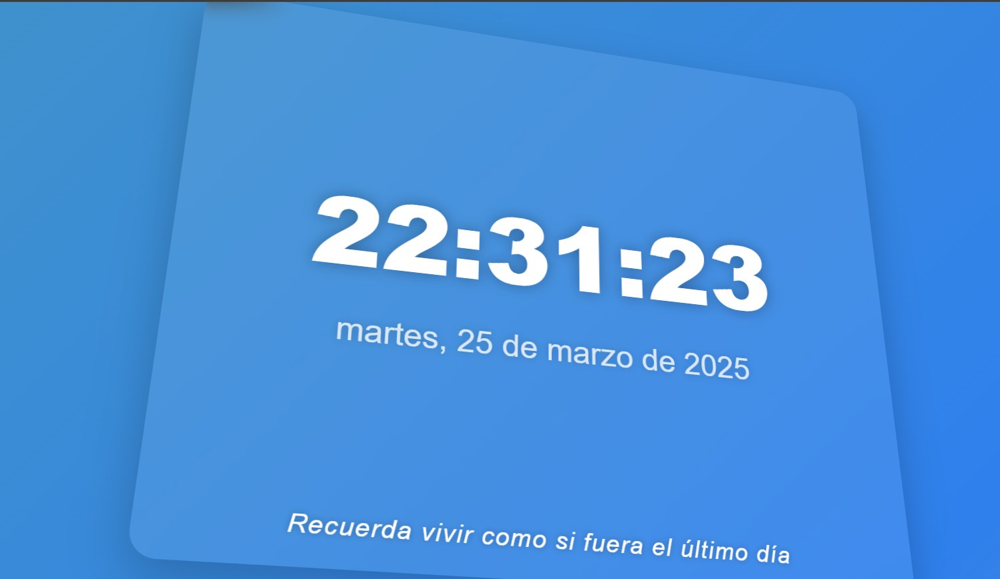

# Proyecto: Efecto Espejo Fullscreen con Hora y Recordatorio

## Descripción
Aplicación web con un diseño futurista que muestra la hora actual, la fecha y un mensaje motivacional. Incluye efectos visuales como degradado animado, efecto de flotación 3D y diseño adaptable a todo tipo de pantallas.

## Características Principales
- **Diseño Fullscreen**: Ocupa toda la ventana del navegador
- **Degradado Animado**: Fondo con transición de colores azules
- **Efecto 3D**: Tarjeta con perspectiva y animación de flotación
- **Reloj Dinámico**: Actualización en tiempo real de hora y fecha
- **Texto Motivacional**: Recordatorio fijo en la parte inferior
- **Responsive Design**: Se adapta a móviles y pantallas grandes

## Tecnologías Utilizadas
- HTML5
- CSS3 (Animaciones, Flexbox, Gradientes)
- JavaScript (Manipulación del DOM)
